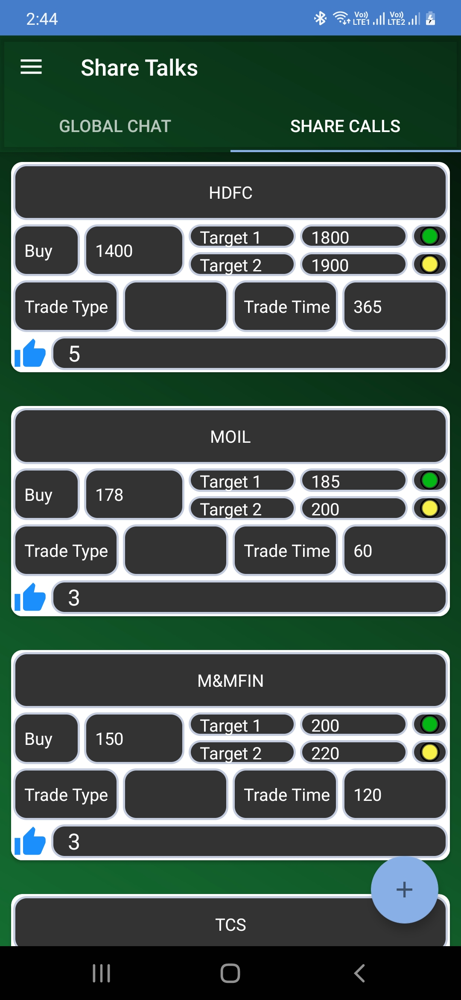
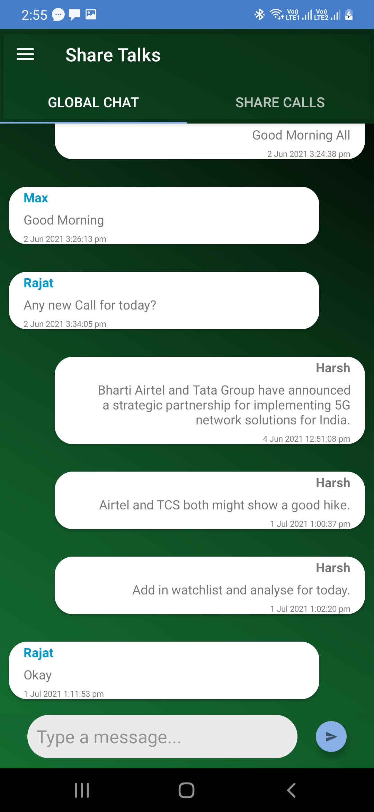
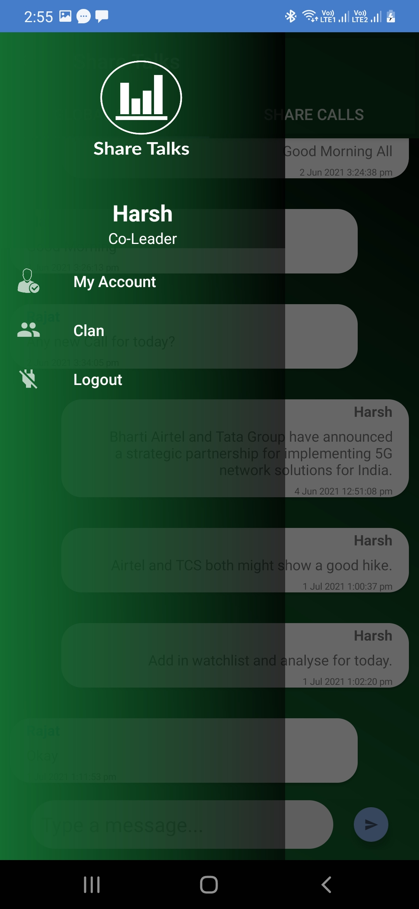

# ShareTalks
## Stocks buy calls and Chat room.
This repository contains an individual Android Studio project that creates a platform for communication among traders of all skill levels to discuss strategy and the hottest stocks moving the market. 

## Development Environment
- Android Studio 4.1
- Android SDK
- Java 1.8
- Google Firebase

## Some Screenshots of the App.  
### Post Tab  
  
### Chat Tab  
  
### Profile Nav  
  

#### NOTE: 
1 Issue I faced here was that I needed instant notification from one device to multiple devices. Problem with using "Topics was time latency and the requirement was instant notification.Whereas using registration token had issues with lot of deprecated libraries and size limitations. Here, [One Signal](https://onesignal.com/) was a big relief.
## Creds:   
###### All Google page links are purple :joy: . Listing those which I remember.
  - [Android Devloper](https://developer.android.com/)
  - [Google Firebase](https://firebase.google.com/)
  - [GeekforGeeks](https://www.geeksforgeeks.org/how-to-use-firebase-firestore-as-a-realtime-database-in-android/)
